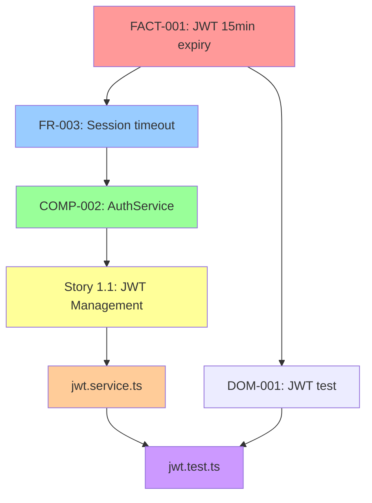

# Oracle Task: Generate Traceability Map

**Task ID:** oracle-generate-traceability-map
**Agent:** Oracle
**Category:** Traceability
**When to Use:** Create visual map of how domain truth flows through all artifacts

---

## Purpose

Generate a comprehensive map showing how canonical domain facts trace through:
- Domain Truth → PRD Requirements → Architecture Components → Stories → Code → Tests

This map ensures:
- 100% domain fact coverage in artifacts
- No orphaned requirements (not traced to domain truth)
- Full bidirectional traceability
- Visual proof of requirement flow

---

## Context

You are the Oracle agent. Domain truth is the source of all requirements, but proving every fact flows through the system requires comprehensive tracing. This task creates that proof.

**Output:** Machine-readable + human-readable traceability map.

---

## Inputs Required

1. **Domain truth file** (`domain-truth.yaml`)
2. **All project artifacts** (PRD, Architecture, Stories, Code, Tests)

**Optional:**
- **Existing traceability matrix** (for updates)
- **Scope** (full | requirements | code | tests)

---

## Traceability Map Generation Process

### Step 1: Load All Artifacts

```yaml
artifacts:
  source_of_truth:
    - domain-truth.yaml
    - existing-system-truth.yaml  # If brownfield
    - enhancement-truth.yaml      # If brownfield

  requirements:
    - prd.md
    - ux-spec.md  # Optional

  design:
    - architecture.md

  planning:
    - epics/*.md
    - stories/**/*.md

  implementation:
    - src/**/*

  validation:
    - test/**/*
    - test-datasets/**/*
```

### Step 2: Extract Traceability Links

For each domain fact, trace downstream:

```yaml
traceability_chain:
  source:
    artifact: "domain-truth.yaml"
    fact_id: "FACT-001"
    fact: "JWT tokens expire after 15 minutes"
    category: "authentication"

  requirements_level:
    - artifact: "prd.md"
      requirement_id: "FR-003"
      content: "User sessions must timeout after 15 minutes of inactivity"
      line: 78
      traces_to: "FACT-001"
      trace_type: "implements"

  architecture_level:
    - artifact: "architecture.md"
      component_id: "COMP-002"
      content: "AuthService: JWT generation with 15-minute TTL"
      line: 145
      traces_to: "FR-003"
      trace_type: "implements"

  story_level:
    - artifact: "stories/epic-1/story-1.1.md"
      story_id: "1.1"
      title: "Implement JWT Token Management"
      traces_to: ["FR-003", "COMP-002"]
      trace_type: "implements"

  code_level:
    - artifact: "src/auth/jwt.service.ts"
      line: 42
      content: "expiresIn: '15m'"
      traces_to: "Story 1.1"
      trace_type: "implements"

  test_level:
    - artifact: "test/auth/jwt.test.ts"
      test_id: "jwt-expiry-test"
      content: "expect(token).toExpireAfter(15 * 60 * 1000)"
      traces_to: ["FR-003", "Story 1.1"]
      trace_type: "validates"

    - artifact: "test-datasets/domain/authentication.csv"
      test_case_id: "DOM-001"
      content: "Valid JWT token test"
      traces_to: "FACT-001"
      trace_type: "validates"
```

### Step 3: Build Traceability Matrix

Create comprehensive matrix:

```yaml
traceability_matrix:
  version: "1.0"
  generated: "2025-10-04T10:30:00Z"
  project: "{{project_name}}"

  summary:
    total_domain_facts: 47
    total_requirements: 89
    total_architecture_components: 23
    total_stories: 156
    total_code_files: 312
    total_tests: 487

    coverage:
      domain_facts_with_requirements: 47/47 (100%)
      requirements_with_stories: 89/89 (100%)
      stories_with_code: 156/156 (100%)
      code_with_tests: 312/312 (100%)
      domain_facts_with_tests: 47/47 (100%)

  traces:
    - fact_id: "FACT-001"
      fact: "JWT tokens expire after 15 minutes"

      forward_trace:
        requirements: ["FR-003"]
        architecture: ["COMP-002"]
        stories: ["1.1"]
        code: ["src/auth/jwt.service.ts:42"]
        tests: ["test/auth/jwt.test.ts", "test-datasets/domain/authentication.csv:DOM-001"]

      backward_trace:
        from_test: "test/auth/jwt.test.ts"
        validates_code: "src/auth/jwt.service.ts:42"
        implements_story: "1.1"
        implements_architecture: "COMP-002"
        implements_requirement: "FR-003"
        validates_fact: "FACT-001"

      coverage: "complete"
      gaps: []

    - fact_id: "FACT-002"
      fact: "Email verification required before login"

      forward_trace:
        requirements: ["NFR-002"]
        architecture: ["COMP-005"]
        stories: ["1.2", "1.3"]
        code: ["src/auth/login.service.ts:67", "src/notifications/email.service.ts:89"]
        tests: ["test/auth/login.test.ts", "test-datasets/domain/verification.csv:DOM-003"]

      backward_trace:
        # ... (same structure)

      coverage: "complete"
      gaps: []

  orphaned_items:
    orphaned_requirements:
      - requirement_id: "FR-027"
        artifact: "prd.md:234"
        content: "User can export data to CSV"
        issue: "No corresponding domain fact"
        severity: "critical"
        action: "Either add to domain truth or remove requirement"

    orphaned_stories:
      - story_id: "2.7"
        artifact: "stories/epic-2/story-2.7.md"
        content: "Implement admin dashboard"
        issue: "No corresponding PRD requirement"
        severity: "critical"
        action: "Add to PRD or remove story"

    orphaned_code:
      - file: "src/analytics/tracker.ts"
        issue: "No story or requirement for analytics"
        severity: "warning"
        action: "Document as technical infrastructure or create story"

    untested_code:
      - file: "src/payments/refund.service.ts"
        issue: "No tests found"
        severity: "critical"
        action: "Create test suite"

  gaps:
    domain_facts_without_tests:
      - fact_id: "FACT-015"
        fact: "Rate limiting: 100 requests per minute"
        has_requirement: true
        has_code: true
        has_tests: false ❌
        action: "Create rate limiting tests"

    requirements_without_implementation:
      - requirement_id: "FR-042"
        content: "User can change email address"
        has_story: true
        has_code: false ❌
        action: "Implement or mark as future work"
```

### Step 4: Generate Visual Map

Create Mermaid diagram:



### Step 5: Validate Traceability

Check for issues:

```yaml
validation:
  forward_traceability:
    domain_facts_without_requirements: []  # Should be empty
    requirements_without_architecture: []
    stories_without_code: []
    code_without_tests: ["src/payments/refund.service.ts"]  # ❌

  backward_traceability:
    tests_without_requirements: []
    code_without_stories: ["src/analytics/tracker.ts"]  # ❌
    requirements_without_domain_facts: ["FR-027"]  # ❌

  bidirectional_check:
    fact_FACT001:
      forward: ✅ Complete chain to tests
      backward: ✅ Tests trace back to fact

    fact_FACT015:
      forward: ⚠️ Missing tests
      backward: N/A

  coverage_percentage:
    domain_to_requirements: 100%
    requirements_to_code: 98%
    code_to_tests: 95%
    end_to_end: 95%
```

---

## Output Format

### Machine-Readable Format

**File:** `docs/validation/traceability-matrix.yaml`

Use template: `bmad-core/templates/traceability-matrix-tmpl.yaml`

```yaml
traceability_matrix:
  # Full YAML structure (as shown above)
```

### Human-Readable Format

**File:** `docs/validation/traceability-map.md`

```markdown
# Traceability Map

**Generated:** 2025-10-04
**Coverage:** 95% End-to-End

## Summary
- Domain Facts: 47 (100% traced to requirements)
- Requirements: 89 (98% implemented)
- Stories: 156 (100% implemented)
- Code Files: 312 (95% tested)
- Tests: 487

## Traceability Chains

### FACT-001: JWT Token Expiry
```
domain-truth.yaml#FACT-001
  ↓
prd.md#FR-003 (Session timeout)
  ↓
architecture.md#COMP-002 (AuthService)
  ↓
stories/epic-1/story-1.1.md (JWT Management)
  ↓
src/auth/jwt.service.ts:42
  ↓
test/auth/jwt.test.ts + test-datasets/domain/authentication.csv#DOM-001
```
**Status:** ✅ Complete

## Gaps

### Missing Tests
- FACT-015 (Rate limiting) - Has code, no tests

### Orphaned Requirements
- FR-027 (Export to CSV) - Not in domain truth

### Orphaned Code
- src/analytics/tracker.ts - No requirement or story

## Recommendations
1. Add tests for FACT-015
2. Review FR-027: Add to domain truth or remove
3. Document analytics as infrastructure or create backlog item
```

### Visual Format

**File:** `docs/validation/traceability-diagram.mmd`

Full Mermaid flowchart of all traces.

---

## Success Criteria

- [ ] All domain facts traced to requirements (100%)
- [ ] All requirements traced to code (>95%)
- [ ] All code traced to tests (>95%)
- [ ] No orphaned requirements (not traced to domain truth)
- [ ] Traceability matrix generated (YAML + Markdown)
- [ ] Visual diagram created

---

## Examples

### Example 1: Complete Chain

```yaml
FACT-003 → FR-007 → COMP-008 → Story 2.1 → src/users/profile.ts → test/users/profile.test.ts
```
**Status:** ✅ Complete traceability

### Example 2: Broken Chain

```yaml
FACT-015 → FR-023 → COMP-015 → Story 3.5 → src/limits/rate-limiter.ts → ❌ NO TESTS
```
**Status:** ⚠️ Missing test coverage

### Example 3: Orphan

```yaml
❌ NO DOMAIN FACT → FR-027 → Story 4.3 → src/export/csv.ts
```
**Status:** ❌ Requirement not traced to domain truth

---

## Integration Points

**Called by:**
- Validator agent (for validation-chain-proof)
- User (manual traceability audit)
- CI/CD (automated traceability check)

**Uses:**
- Oracle `validate-artifact-against-truth`
- Validator `validate-traceability`

**Outputs to:**
- Validator (for proof generation)
- Monitor (for coverage tracking)

---

## Command Signature

```bash
bmad oracle generate-traceability-map \
  --truth docs/domain-truth.yaml \
  --artifacts docs/,src/,test/ \
  --output docs/validation/traceability-matrix.yaml \
  --format yaml,markdown,mermaid
```

---

**Complete traceability = Proof of correctness.**
